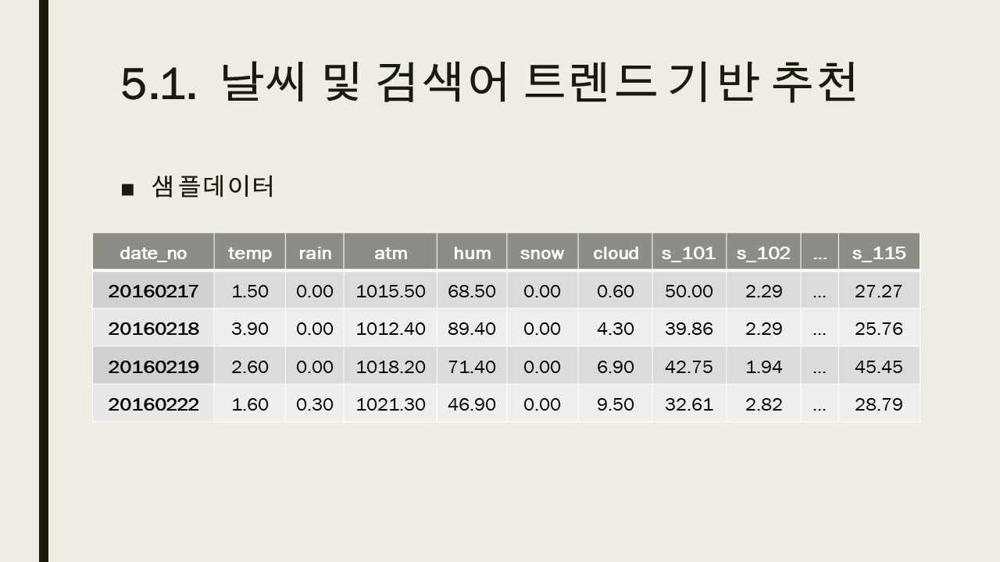

# INHA_MENU_RECOMMEND
인하대학교 식사 메뉴추천

'날씨, 검색어 트렌드', '관심 키워드' 활용한 식사메뉴 추천

Inha Univ   
Infomatioin and communication engineering   
Database
Final project   

## Main Page
   

### 주요화면
* 카테고리 별 음식점 분류
* 날씨 및 검색어 트렌드 데이터를 활용한 식사메뉴추천
* 관심 키워드와 매칭되는 음식점 추천
* 홍보게시글

### 설명
   
   
   
   
   
   
   
   
   
   
   
   
   
   
   
   
   
   
   
   
   
  
    

## Refer this files(KOR)
* [Download](https://drive.google.com/file/d/1uPG28E15cxgN1PsLrNsEYnel_gKDrXWN/view?usp=sharing) - REPORT
* [Download](https://drive.google.com/file/d/1RmNIMnBvVwuK1a8MCibUr1JwHPpNwTdk/view?usp=sharing) - PPT

